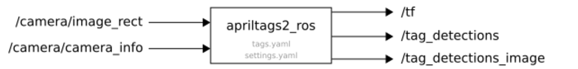

# 项目结构

```shell
.
├── apriltag_detection
│   ├── apriltag.rviz
│   ├── CMakeLists.txt
│   ├── config
│   │   ├── ost.yaml               //相机标定文件
│   │   ├── settings.yaml          //apriltag检测的设置文件
│   │   └── tags.yaml              //设置需要检测的tag的id和大小
│   ├── launch
│   │   ├── camera.launch           //启动usb_cam摄像头结点
│   │   └── continuous_detection.launch //启动apriltag的检测
│   └── package.xml
├── apriltag_position
│   ├── CMakeLists.txt
│   ├── config
│   ├── include
│   │   └── apriltag_position
│   ├── launch
│   ├── msg
│   │   └── DetectionInfo.msg
│   ├── package.xml
│   └── src
│       └── apriltag_position_node.cpp       //话题转换结点
├── CMakeLists.txt
└── common
    ├── CMakeLists.txt
    ├── include
    │   ├── geometry_utils.h
    │   ├── math_utils.h
    │   └── printf_utils.h
    ├── prometheus_msgs
    └── quadrotor_msgs

```

# 如何使用

## 安装apriltag_ros功能包

```she
sudo apt install ros-$ROS_DISTRO-apriltag-ros
```


## 启动摄像头

### 安装摄像头需要的包

```shell
sudo apt install ros-noetic-usb-cam
```


### 启动

这里使用的是项目里面的，如果自己的项目有了就不需要启动这个了。

```shell	
roslaunch apriltag_detection camera.launch
```


## 启动apriltag检测

```shell
roslaunch apriltag_detection continuous_detection.launch 
```

这个结点主要封装apriltag_ros




主要修改了参数文件载入路径和相机名称，可以根据需要来灵活修改

```xml
<launch>
	<arg name="launch_prefix" default="" /> <!-- set to value="gdbserver localhost:10000" for remote debugging -->
	<arg name="node_namespace" default="apriltag_ros_continuous_node" />
	<arg name="camera_name" default="/usb_cam" />
	<arg name="image_topic" default="image_rect" />

	<!-- Set parameters -->
	<rosparam command="load" file="$(find apriltag_detection)/config/settings.yaml" ns="$(arg node_namespace)" />
	<rosparam command="load" file="$(find apriltag_detection)/config/tags.yaml" ns="$(arg node_namespace)" />

	<node pkg="apriltag_ros" type="apriltag_ros_continuous_node" name="$(arg node_namespace)" clear_params="true" output="screen" launch-prefix="$(arg launch_prefix)" >
		<!-- Remap topics from those used in code to those on the ROS network -->
		<remap from="image_rect" to="$(arg camera_name)/$(arg image_topic)" />
		<remap from="camera_info" to="$(arg camera_name)/camera_info" />

		<param name="publish_tag_detections_image" type="bool" value="true" />      <!-- default: false -->
	</node>
</launch>

```

## 启动话题转化结点

```shel
rosrun apriltag_position apriltag_position
```


# 参考链接

1. https://bingda.yuque.com/staff-hckvzc/ai5gkn/easncqctnt0dilp6
2. https://april.eecs.umich.edu/software/apriltag.html
3. https://wiki.ros.org/apriltag_ros
4. https://bingda.yuque.com/staff-hckvzc/ai5gkn/nu8kcf


